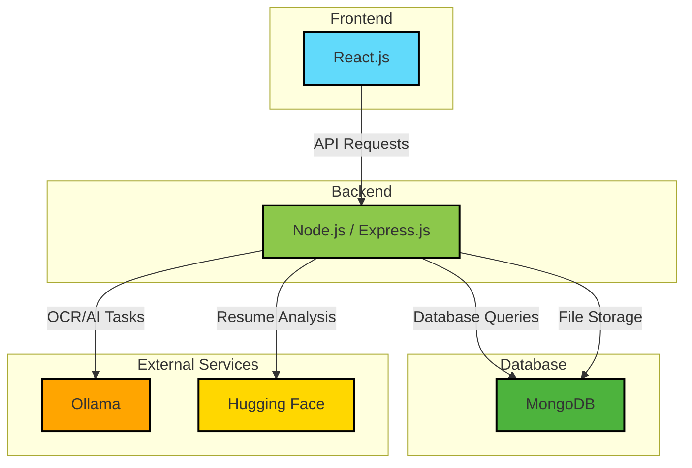
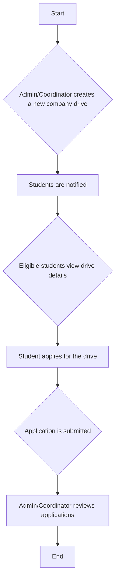
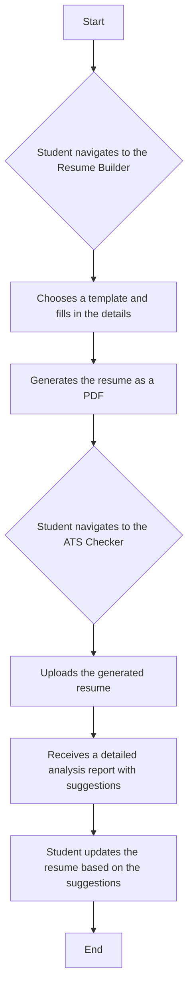

# Placement Portal

The Placement Portal is a comprehensive web application designed to streamline and automate the entire campus placement process. It serves as a centralized platform for students, placement coordinators, and administrators to manage and track all placement-related activities, from student registration to company drives and final placements.

This application is built with the MERN stack (MongoDB, Express.js, React, Node.js) and features a modern, responsive user interface. It provides role-based access control, ensuring that each user has access to the features and information relevant to their role.

## Key Features

The Placement Portal offers a wide range of features tailored to the needs of each user role:

### For Students

*   **Dashboard:** A personalized dashboard with an overview of upcoming company drives, training sessions, and placement statistics.
*   **Profile Management:** A comprehensive profile section where students can manage their personal, academic, and contact information.
*   **Resume Builder:** A powerful tool to create professional resumes from scratch using a variety of templates.
*   **ATS Resume Checker:** An integrated ATS (Applicant Tracking System) checker that analyzes resumes for compatibility with modern recruitment systems and provides suggestions for improvement.
*   **Resume Upload:** Students can upload their existing resumes, which are then analyzed for key skills and information.
*   **Company and Drive Information:** A dedicated section to view details of upcoming company drives, including eligibility criteria, job descriptions, and application deadlines.
*   **Training and Achievements:** Students can view and enroll in training programs and upload their achievements and certificates.
*   **Marksheet Upload:** A feature to upload semester marksheets, with OCR capabilities to extract and verify academic data.

### For Placement Coordinators

*   **Dashboard:** A dashboard with an overview of the placement activities for their respective departments.
*   **Student Management:** Coordinators can view and manage the profiles of students in their department.
*   **Company and Drive Management:** View and manage company profiles and drives.
*   **Certificate Verification:** A tool to verify the authenticity of student certificates.
*   **Attendance Management:** Track student attendance for company drives and training sessions.
*   **Reporting and Analysis:** Generate reports on placement statistics, company-wise placements, and more.

### For Administrators

*   **Centralized Dashboard:** A comprehensive dashboard with a bird's-eye view of all placement activities across all departments.
*   **User Management:** Manage all users, including students, coordinators, and other administrators.
*   **Student Database:** A complete database of all students with advanced search and filtering capabilities.
*   **Training Management:** Create, schedule, and manage training programs for students.
*   **Company and Drive Management:** Add, edit, and manage company profiles and placement drives.
*   **Eligible Students Management:** A powerful tool to determine and manage the eligibility of students for various drives based on academic criteria and company requirements.
*   **Attendance and Placement Tracking:** Monitor attendance for all drives and track the status of placed students.
*   **Comprehensive Reporting:** Generate a wide range of reports for analysis and decision-making.

## Architecture

The Placement Portal is built on the MERN stack, with a clear separation between the frontend and backend.




### Frontend

*   **Framework:** React.js
*   **UI Library:** Material-UI (MUI)
*   **Routing:** React Router
*   **State Management:** React Context API
*   **Styling:** CSS Modules, Framer Motion

### Backend

*   **Framework:** Node.js with Express.js
*   **Database:** MongoDB with Mongoose
*   **Authentication:** JSON Web Tokens (JWT)
*   **File Storage:** GridFS for storing resumes, certificates, and other files.
*   **OCR and AI:**
    *   `pdf-parse` for extracting text from digital PDFs.
    *   Ollama with vision models for OCR on scanned documents.
    *   Integration with Hugging Face and other AI services for resume analysis.

## User Flow

Here are some of the key user flows in the application:

### Student Registration and Login Flow

```mermaid
graph TD
    A[Start] --> B{User visits the portal};
    B --> C[Clicks on "Sign Up"];
    C --> D[Fills out the sign-up form];
    D --> E{Submits the form};
    E --> F[Completes the registration process with personal and academic details];
    F --> G[Receives confirmation];
    G --> H{User logs in with credentials};
    H --> I[Accesses the student dashboard];
    I --> J[End];
```

### Company Drive Application Flow



### Resume Building and Analysis Flow




## Installation and Setup

To get the project running locally, follow these steps:

### Prerequisites

*   Node.js and npm
*   MongoDB
*   Ollama (for OCR and AI features)

### Frontend

1.  Navigate to the root directory of the project.
2.  Install the dependencies:
    ```bash
    npm install
    ```
3.  Start the development server:
    ```bash
    npm start
    ```

### Backend

1.  Navigate to the `backend` directory.
2.  Install the dependencies:
    ```bash
    npm install
    ```
3.  Create a `.env` file and add the following environment variables:
    ```
    MONGO_URI=<your_mongodb_connection_string>
    JWT_SECRET=<your_jwt_secret>
    OLLAMA_URL=<your_ollama_api_url>
    ```
4.  Start the server:
    ```bash
    npm start
    ```

## Technologies Used

*   **Frontend:**
    *   React.js
    *   Material-UI (MUI)
    *   React Router
    *   Axios
    *   Framer Motion
    *   Recharts
    *   jsPDF

*   **Backend:**
    *   Node.js
    *   Express.js
    *   MongoDB
    *   Mongoose
    *   JWT
    *   Bcrypt.js
    *   Multer and GridFS
    *   Puppeteer
    *   pdf-parse
    *   Ollama

*   **Development:**
    *   Nodemon
    *   Concurrently
    *   ESLint
    *   Prettier

## Contributing

Contributions are welcome! Please feel free to submit a pull request or open an issue if you have any suggestions or find any bugs.
