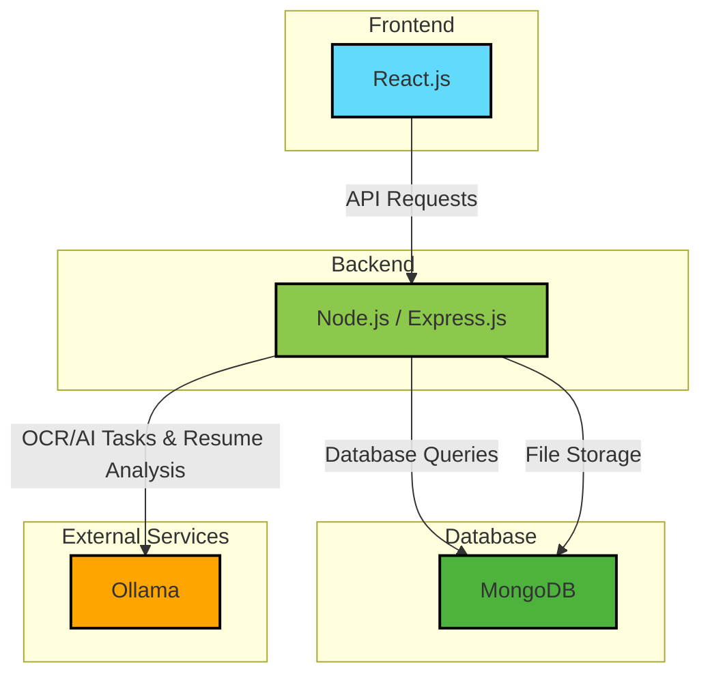

```mermaid
graph TD
    subgraph Frontend
        A[React.js]
    end

    subgraph Backend
        B[Node.js / Express.js]
    end

    subgraph Database
        C[MongoDB]
    end

    subgraph "External Services"
        D[Ollama]

    end

    A -- "API Requests" --> B
    B -- "Database Queries" --> C
    B -- "File Storage" --> C
    B -- "OCR/AI Tasks & Resume Analysis" --> D

    style A fill:#61DAFB,stroke:#000,stroke-width:2px
    style B fill:#8CC84B,stroke:#000,stroke-width:2px
    style C fill:#4DB33D,stroke:#000,stroke-width:2px
    style D fill:#FFA500,stroke:#000,stroke-width:2px
```
