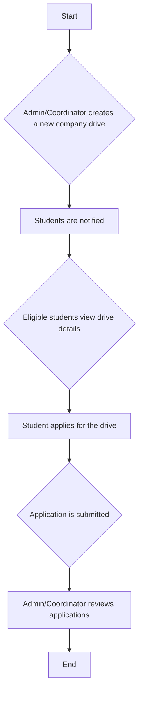

```mermaid
graph TD
    A[Start] --> B{Admin/Coordinator creates a new company drive};
    B --> C[Students are notified];
    C --> D{Eligible students view drive details};
    D --> E[Student applies for the drive];
    E --> F{Application is submitted};
    F --> G[Admin/Coordinator reviews applications];
    G --> H[End];
```
