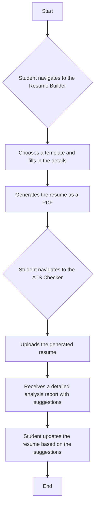

```mermaid
graph TD
    A[Start] --> B{Student navigates to the Resume Builder};
    B --> C[Chooses a template and fills in the details];
    C --> D[Generates the resume as a PDF];
    D --> E{Student navigates to the ATS Checker};
    E --> F[Uploads the generated resume];
    F --> G[Receives a detailed analysis report with suggestions];
    G --> H[Student updates the resume based on the suggestions];
    H --> I[End];
```
